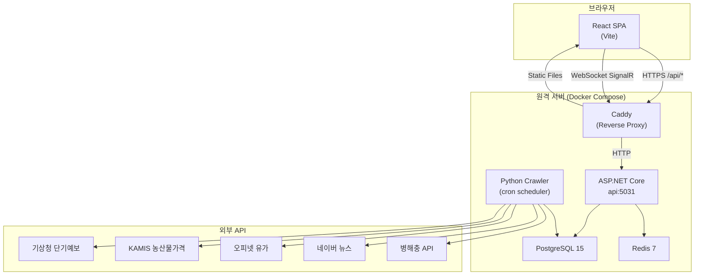
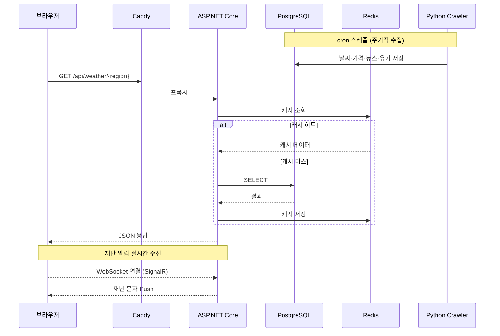
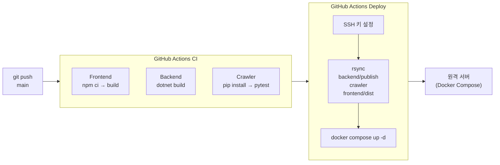

# Agri-Market Hub

농업 종사자를 위한 실시간 농업 정보 대시보드. 날씨·시세·뉴스·병해충 정보를 한 화면에서 제공합니다.

## 주요 기능

### 대시보드
- 패널 드래그 리사이즈 — 열 너비·하단 패널 높이 자유 조절, localStorage에 레이아웃 저장
- 재난 문자 실시간 수신 (SignalR WebSocket)
- 뉴스 티커 — 병해충·작황 최신 5건 자동 스크롤

### 날씨 패널
- 기상청 단기예보 API — 현재 기온·습도·바람·강수량
- 5일 예보 + 강수확률 시각화 바
- 94개 시·군 즐겨찾기 — 검색으로 추가·삭제, localStorage 저장

### 농산물 가격 패널 (KAMIS)
- 4월 제철 품목 실시간 시세
- 관심 품목 추가/삭제 (위시리스트)
- 전일 대비 등락률 표시

### 뉴스 패널
- 네이버 뉴스 API — 작황·가격·물류·정책·병해충 탭별 분류
- 헤드라인 탭 — 병해충·작황 최신 6건 자동 합산

### 지도 패널
- Leaflet + OpenStreetMap 기반
- 레이어 토글: 도매시장 / 산지 / 기상특보 / 병해충

### 캘린더 & 일정
- 월별 캘린더 (농업 행사 등록·조회)
- 일정 목록 — D-day 뱃지, 빠른 추가 폼

### 유가 패널
- 오피넷 API — 전국 평균 휘발유·경유 가격

### 알림
- 재난 문자 배너 (SignalR 실시간)
- Web Push 알림 (VAPID)

### 인증
- Google OAuth 2.0 로그인 (auth-code flow, popup)
- Google Calendar 자동 연동 (로그인 시 refresh token 저장)

---

## 기술 스택

### Frontend
| 분류 | 기술 |
|------|------|
| 프레임워크 | React 19 + Vite 8 |
| 라우팅 | React Router v7 |
| HTTP | Axios |
| 실시간 | @microsoft/signalr |
| 지도 | Leaflet + react-leaflet |
| 스타일 | Inline CSS (GitHub Dark 테마) |

### Backend
| 분류 | 기술 |
|------|------|
| 런타임 | .NET 10 (ASP.NET Core) |
| ORM | Entity Framework Core + Npgsql |
| 캐시 | StackExchange.Redis |
| 실시간 | ASP.NET Core SignalR |
| 인증 | JWT Bearer + BCrypt |
| 외부 연동 | Google Calendar API v3, WebPush (VAPID) |
| 테스트 | xUnit + Moq + FluentAssertions |

### Crawler
| 분류 | 기술 |
|------|------|
| 언어 | Python 3.11 |
| DB | psycopg2-binary |
| 스케줄링 | schedule |
| 수집 대상 | 기상청 단기예보, KAMIS 농산물 가격, 오피넷 유가, 네이버 뉴스, 병해충 API |
| 테스트 | pytest + responses |

### 인프라
| 분류 | 기술 |
|------|------|
| DB | PostgreSQL 15 |
| 캐시 | Redis 7 |
| 컨테이너 | Docker Compose |
| 프록시 | Caddy (서버 기존 설치) |
| CI/CD | GitHub Actions — 빌드·테스트 후 SSH/rsync 배포 |

---

## 프로젝트 구성도

### 전체 시스템 아키텍처



### 데이터 흐름



### CI/CD 파이프라인



---

## 환경 변수

`.env.example`을 참고하여 `.env` 파일을 작성합니다. 형식은 동일하며 실제 값만 채우면 됩니다.

| 변수 | 설명 |
|------|------|
| `DB_PASS` | PostgreSQL 비밀번호 |
| `JWT_SECRET` | JWT 서명 키 (32자 이상) |
| `WEATHER_KEY` | 기상청 API 키 (data.go.kr) |
| `KAMIS_KEY` | KAMIS 농산물가격 API 키 |
| `NAVER_CLIENT_ID` | 네이버 검색 API Client ID |
| `NAVER_CLIENT_SECRET` | 네이버 검색 API Secret |
| `VAPID_PUBLIC_KEY` | Web Push 공개 키 |
| `VAPID_PRIVATE_KEY` | Web Push 비밀 키 |
| `GOOGLE_CLIENT_ID` | Google OAuth Client ID |
| `GOOGLE_CLIENT_SECRET` | Google OAuth Client Secret |
| `PEST_KEY` | 농촌진흥청 병해충 API 키 |
| `OPINET_KEY` | 오피넷 유가 API 키 |
| `CORS_ORIGINS` | 허용 도메인 (기본값: https://agri.dooyg.store) |

프론트엔드 빌드에는 `frontend/.env`도 필요합니다.

```env
VITE_GOOGLE_CLIENT_ID=...
```

---

## 실행

```bash
# 서비스 전체 시작
docker compose up -d

# 프론트엔드 개발 서버
cd frontend && npm install && npm run dev
```

---

## CI/CD

`main` 브랜치 푸시 시 GitHub Actions가 자동 실행됩니다.

1. **빌드** — 프론트엔드 `npm run build`, 백엔드 `dotnet publish`, 크롤러 `pip install`
2. **배포** — SSH + rsync로 결과물 전송 → 서버에 `.env` 자동 생성 → `docker compose up -d`

### 필요한 GitHub Secrets

| Secret | 설명 |
|--------|------|
| `SSH_HOST` | 서버 IP 또는 도메인 |
| `SSH_USER` | SSH 접속 사용자명 |
| `SSH_PRIVATE_KEY` | SSH 비밀 키 |
| `DEPLOY_PATH` | 서버의 배포 디렉토리 경로 |
| `STATIC_PATH` | Caddy가 서빙하는 프론트엔드 정적 파일 경로 |
| `GOOGLE_CLIENT_ID` | 프론트엔드 빌드 시 주입 |
| `ENV_FILE` | `.env` 파일 내용 전체 (멀티라인) — 배포 시 서버에 자동 생성 |
